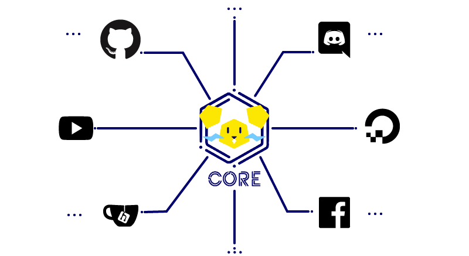

---

This is T.H.O.R. - ThundeRatz Holistic Operational Robot - It is ThundeRatz's virtual entity and it was created to be a central point where all
the team's virtual presence can be connected and managed. It has a core and multiple services, it is a very early stage and most things are NYI.

<!-- Trocar esse diagrama que ficou feião -->

## Core

`core/`

The core is the central part of T.H.O.R. it receives events from multiple services through a go channel and act upon them, replying to the service,
sending events to other services and logging everything.

## Services

`services/`

Services are responsible to deal with a single virtual "entity" and ThundeRatz's presence within it, like GitHub, Discord, Social Networks,
Team's servers, APIs etc...

### GitHub

`services/github`

This service is a GitHub app that can receive webhook events from GitHub and also post in issues, PRs and everything else a GitHub app can do.
It sends the webhook events to the core.

### Discord

`services/discord`

This service is a Discord bot that can receive webhook events from Discord and also post in channels.
It sends the webhook events to the core.

One already implement connection is: GitHub Issue -> Core -> Discord Alert

### Other Services

> NYI

## Packages

There are some "lower-level" packages at `pkg` that wraps other libraries and serves as building blocks for the services and the core.
